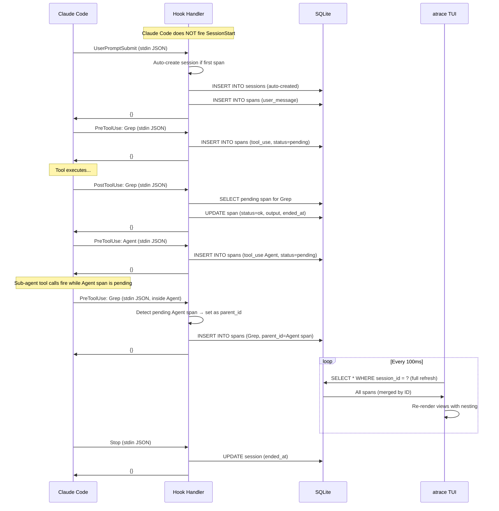
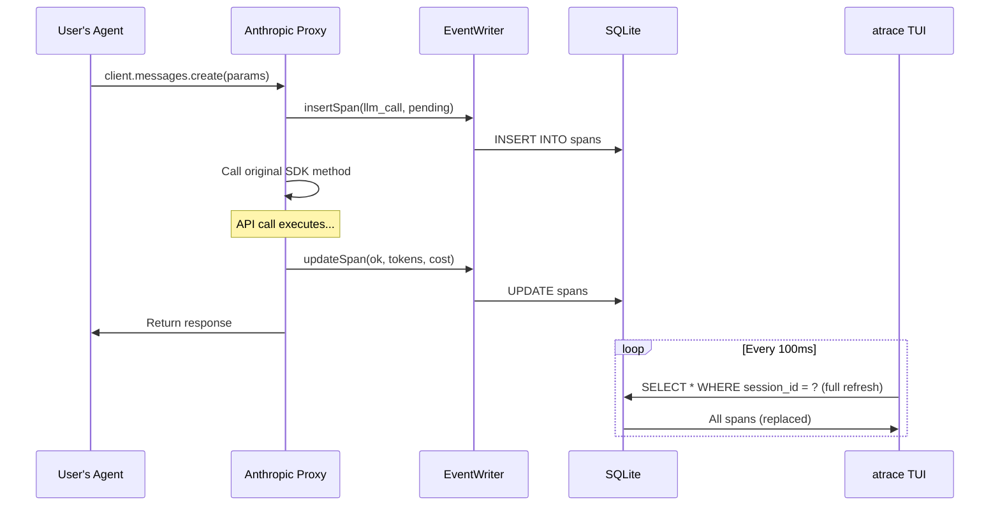
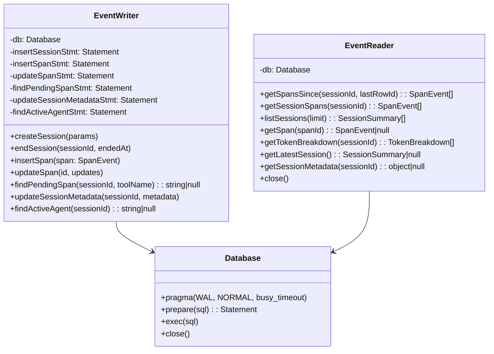
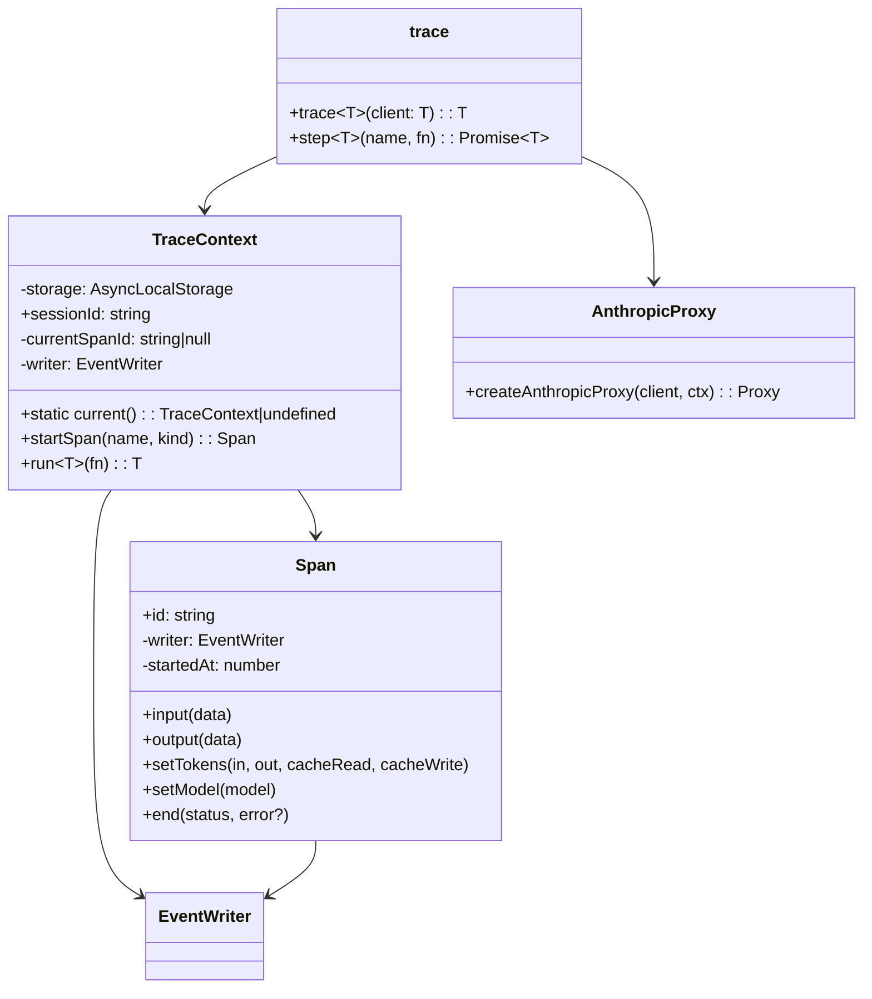
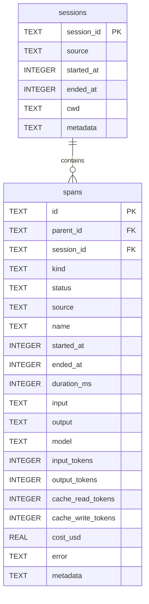

# System Architecture

## Overview

agent-trace is a **local-first observability tool** for AI agents. It captures execution traces from two sources, stores them in SQLite, and presents them via a terminal UI.

---

## High-Level Architecture

### Mermaid Diagram

```mermaid
graph TB
    subgraph "Collection Layer"
        CC[Claude Code CLI]
        UA[User's Agent Code]
        
        CC -->|PreToolUse hook| HH[Hook Handler<br/>subprocess]
        CC -->|PostToolUse hook| HH
        CC -->|UserPromptSubmit hook| HH
        CC -->|Stop hook| HH
        
        UA -->|trace&#40;client&#41;| PX[Anthropic Proxy<br/>JS Proxy]
        UA -->|trace.step&#40;&#41;| SP[Span API]
    end
    
    subgraph "Storage Layer"
        HH -->|INSERT/UPDATE| DB[(SQLite<br/>WAL mode<br/>~/.agent-trace/traces.db)]
        PX -->|INSERT/UPDATE| DB
        SP -->|INSERT/UPDATE| DB
    end
    
    subgraph "Presentation Layer"
        DB -->|Poll every 100ms| TUI[TUI: atrace<br/>Ink/React]
        TUI --> CV[Console View]
        TUI --> TV[Timeline View]
        TUI --> TK[Token View]
        TUI --> SV[Sessions View]
        TUI --> DO[Detail Overlay]
        
        DB -->|session metadata| TP[Transcript Parser]
        TF[Transcript JSONL<br/>file on disk] -->|read every 2s| TP
        TP -->|cost, tokens, model| TUI
        
        TUI --> LD[Loop Detection]
    end
```



### ASCII Diagram

```
┌─────────────────────────────────────────────────────────────────────────┐
│                         COLLECTION LAYER                                 │
│                                                                          │
│  ┌──────────────────────┐          ┌──────────────────────────┐         │
│  │   Claude Code CLI     │          │   User's Agent Code       │         │
│  │                        │          │                            │         │
│  │  PreToolUse  ─────┐    │          │  trace(client) ──────┐     │         │
│  │  PostToolUse ─────┤    │          │  trace.step() ───────┤     │         │
│  │  UserPromptSubmit ┤    │          │                       │     │         │
│  │  Stop ────────────┘    │          └───────────────────────┘     │         │
│  └───────────┬────────────┘                     │                   │
│              │                                  │                   │
│              ▼                                  ▼                   │
│  ┌──────────────────────┐          ┌──────────────────────────┐    │
│  │   Hook Handler        │          │   Anthropic Proxy         │    │
│  │   (Node subprocess)   │          │   (JS Proxy in-process)   │    │
│  │                        │          │                            │    │
│  │   stdin → parse JSON   │          │   Intercepts:              │    │
│  │   → write SQLite       │          │   - messages.create()      │    │
│  │   → stdout '{}'        │          │   - messages.stream()      │    │
│  │   → exit 0             │          │   Records:                 │    │
│  └───────────┬────────────┘          │   - tokens, cost, timing   │    │
│              │                        └──────────────┬─────────────┘    │
└──────────────┼───────────────────────────────────────┼──────────────────┘
               │                                       │
               ▼                                       ▼
┌──────────────────────────────────────────────────────────────────────────┐
│                          STORAGE LAYER                                    │
│                                                                           │
│  ┌─────────────────────────────────────────────────────────────────────┐ │
│  │                    SQLite Database                                    │ │
│  │                    ~/.agent-trace/traces.db                           │ │
│  │                                                                       │ │
│  │  PRAGMA journal_mode = WAL     (concurrent read/write)               │ │
│  │  PRAGMA synchronous = NORMAL   (durability vs speed)                 │ │
│  │  PRAGMA busy_timeout = 5000    (handle contention)                   │ │
│  │                                                                       │ │
│  │  ┌─────────────┐    ┌────────────────────────────────────────────┐  │ │
│  │  │  sessions    │    │  spans                                      │  │ │
│  │  │             │    │  id, parent_id, session_id, kind, status   │  │ │
│  │  │  session_id  │◄───│  source, name, started_at, ended_at       │  │ │
│  │  │  source      │    │  input (JSON), output (JSON, 10KB max)    │  │ │
│  │  │  started_at  │    │  model, input_tokens, output_tokens       │  │ │
│  │  │  ended_at    │    │  cache_read_tokens, cache_write_tokens    │  │ │
│  │  │  cwd         │    │  cost_usd, error, metadata (JSON)         │  │ │
│  │  └─────────────┘    └────────────────────────────────────────────┘  │ │
│  └─────────────────────────────────────────────────────────────────────┘ │
└──────────────────────────────────────────────────────────────────────────┘
               │
               │ full-refresh polling (100ms)
               ▼
┌──────────────────────────────────────────────────────────────────────────┐
│                        PRESENTATION LAYER                                 │
│                                                                           │
│  ┌─────────────────────────────────────────────────────────────────────┐ │
│  │                     TUI (Ink + React)                                 │ │
│  │                                                                       │ │
│  │  ┌──────────┐  ┌──────────┐  ┌──────────┐  ┌──────────────┐        │ │
│  │  │ Console  │  │ Timeline │  │ Tokens   │  │ Sessions     │        │ │
│  │  │ View     │  │ View     │  │ View     │  │ List View    │        │ │
│  │  │          │  │          │  │          │  │              │        │ │
│  │  │ Live     │  │ Waterfall│  │ Per-call │  │ Browse/      │        │ │
│  │  │ event    │  │ bars     │  │ cost     │  │ switch       │        │ │
│  │  │ stream   │  │ chart    │  │ table    │  │ sessions     │        │ │
│  │  │ +loops   │  │          │  │ +transcr │  │              │        │ │
│  │  └──────────┘  └──────────┘  └──────────┘  └──────────────┘        │ │
│  │                                                                       │ │
│  │  ┌─────────────────────┐  ┌────────────────────────────────────┐    │ │
│  │  │ Detail Overlay       │  │ Transcript Parser                   │    │ │
│  │  │ (Enter on any span)  │  │ Reads JSONL file every 2s           │    │ │
│  │  │ Full I/O JSON        │  │ transcript_path from session meta   │    │ │
│  │  │ Esc/q to close       │  │ → cost, tokens, model, turn count  │    │ │
│  │  └─────────────────────┘  └────────────────────────────────────┘    │ │
│  └─────────────────────────────────────────────────────────────────────┘ │
└──────────────────────────────────────────────────────────────────────────┘
```

---

## Data Flow

### Mode 1: Claude Code Hook Collection



### Mode 2: SDK Wrapper Collection



### Transcript Parsing Data Flow (Hook Mode Cost Tracking)

```
Claude Code writes transcript JSONL file to disk
     │
     │  (path stored in every hook stdin as `transcript_path`)
     │
     ▼
Hook Handler (first span)
     │
     │  Stores transcript_path in session metadata
     │  (sessions.metadata JSON column)
     │
     ▼
SQLite sessions table
     │
     │  TUI reads session metadata to get transcript_path
     │
     ▼
Transcript Parser (useTranscriptCost hook)
     │  Reads JSONL file directly from disk every 2s
     │  Extracts per-turn: model, input_tokens, output_tokens,
     │    cache_read_input_tokens, cache_creation_input_tokens
     │  Calculates cost using model-specific pricing
     │
     ▼
TUI receives: total cost, model name, LLM turn count, token breakdown
     │
     ├──→ StatusBar: live cost (red >$1, bold >$0.50), model, turns
     └──→ TokenView: full session summary from transcript
```

This design keeps expensive transcript parsing in the TUI process (which has time to spare between renders) rather than in the hook handler subprocess (which must complete in <200ms). See ADR-013.

---

## Component Architecture

### Storage Layer



### TUI Component Tree

```
<App>
├── <TabBar tabs={['Console','Timeline','Tokens','Sessions']} />
├── <ConsoleView>          (when tab === 0)
│   ├── <LoopWarnings />   (top 3 loop detection warnings)
│   └── <EventRow /> × N
├── <TimelineView>         (when tab === 1)
│   └── <WaterfallBar /> × N
├── <TokenView>            (when tab === 2)
│   └── <TokenTable />     (now includes transcript summary in hook mode)
├── <SessionListView>      (when tab === 3)
├── <SpanDetail />         (overlay on Enter, Esc/q to close)
└── <StatusBar />          (live cost, model, LLM turn count)
```

### SDK Wrapper Class Diagram



---

## Database Schema

### Entity-Relationship



### Indexes

| Index | Purpose |
|-------|---------|
| `idx_spans_session_ts` | Fast span retrieval by session + time ordering |
| `idx_spans_parent` | Parent-child span relationships |
| `idx_spans_status` | Find pending spans for Pre/Post correlation |
| `idx_sessions_started` | List sessions in reverse chronological order |

### SQLite Configuration

| Pragma | Value | Reason |
|--------|-------|--------|
| `journal_mode` | WAL | Allows concurrent readers + single writer without blocking |
| `synchronous` | NORMAL | Balance between durability and performance |
| `busy_timeout` | 5000 | Wait up to 5s for lock instead of failing immediately |
| `cache_size` | -8000 | 8MB page cache for fast repeated queries |
| `foreign_keys` | ON | Enforce referential integrity |

---

## Concurrency Model

```
Hook Process A (PreToolUse)  ──┐
Hook Process B (PostToolUse) ──┤──► SQLite WAL ◄── TUI (read-only polling)
Hook Process C (PreToolUse)  ──┘
```

- **Writers**: Multiple hook subprocesses can write concurrently thanks to WAL mode
- **Reader**: TUI polls with full-refresh SELECT (never blocks writers)
- **Contention handling**: `busy_timeout = 5000ms` means a writer will retry for up to 5 seconds if another writer holds the lock
- **No connection pooling needed**: Each hook process opens DB, writes 1 row, closes. Short-lived connections.

---

## Sub-Agent Nesting

### How It Works

When Claude Code dispatches a sub-agent (tool_name `Agent`), the hook handler creates a parent span. All subsequent tool calls that occur while the Agent span is pending are automatically linked as children via `parent_id`.

```
Agent (pending)           ← parent span
├── Grep                  ← child: parent_id = Agent span ID
├── Read                  ← child: parent_id = Agent span ID
└── Edit                  ← child: parent_id = Agent span ID
Agent (complete)          ← PostToolUse closes the parent
```

### Detection Logic (Hook Handler)

On each PreToolUse, the hook handler queries for a pending Agent span in the same session:

```sql
SELECT id FROM spans
WHERE session_id = ? AND name = 'Agent' AND status = 'pending'
ORDER BY started_at DESC LIMIT 1
```

If found, the new span's `parent_id` is set to the Agent span's ID. This supports arbitrary nesting depth (Agent within Agent).

### TUI Rendering

- **Console view**: Child spans are indented with `└` prefix under their parent Agent span
- **Timeline view**: Child spans are rendered in indented swim lanes beneath the parent

### Auto-Session Creation

Claude Code does not fire a `SessionStart` event. The hook handler auto-creates a session row on the first span received for a given `session_id`. This ensures sessions always exist before child spans reference them.

---

## Security Model

- **No network exposure**: Everything runs locally. No servers, no ports (except Docker dev mode).
- **No secrets stored**: API keys are never captured. Only tool names/inputs/outputs and token counts.
- **Output truncation**: Tool outputs capped at 10KB to prevent accidental secret leakage in large outputs.
- **Hook isolation**: Hooks run as separate processes. A crash in the hook handler doesn't affect Claude Code (exit 0 always).
- **File permissions**: Database inherits user's umask. No world-readable files.

---

## Performance Characteristics

| Operation | Target | Actual |
|-----------|--------|--------|
| Hook handler cold start | < 200ms | ~80-150ms |
| Hook handler total (stdin → exit) | < 500ms | ~100-250ms |
| TUI poll cycle | 100ms | 100ms fixed |
| SQLite INSERT (single span) | < 5ms | ~1-3ms |
| SQLite SELECT (full refresh poll, ~50 rows) | < 5ms | ~1-3ms |
| SQLite SELECT (full refresh poll, ~500 rows) | < 10ms | ~3-8ms |
| TUI re-render (100 events) | < 16ms | Depends on terminal |

---

## Failure Modes

| Failure | Behavior | Recovery |
|---------|----------|----------|
| Hook handler crashes | Writes `{}` to stdout, exits 0. Claude Code continues unaffected. | Automatic |
| SQLite locked (busy) | Retries for 5 seconds (busy_timeout). Hook may timeout. | Lost single event, next hook succeeds |
| TUI can't open DB | Displays error message, suggests checking path | User fixes path |
| Malformed hook stdin | Logs to debug.log, outputs `{}`, exits 0 | Automatic |
| DB file corrupted | SQLite WAL recovery on next open | Automatic for most corruption |
| Disk full | INSERT fails, hook exits 0 | User frees space |

---

## Extensibility Points

1. **New collectors**: Add to `src/collector/` — any code that produces `SpanEvent` objects and writes via `EventWriter`
2. **New TUI views**: Add to `src/tui/views/` and register in `App.tsx` tab list
3. **New providers**: Add proxy handler in `src/collector/sdk-wrapper/` (e.g., `openai-proxy.ts`)
4. **Custom pricing**: Extend `src/util/cost.ts` MODEL_PRICING table
5. **Export formats**: Add commands to CLI that read from `EventReader` and format output
