# SDK Wrapper Specification

## Overview

The SDK wrapper provides automatic instrumentation of the Anthropic TypeScript SDK. By wrapping the client with `trace()`, all API calls are recorded to SQLite without any other code changes.

---

## Public API

### `trace<T>(client: T): T`

Wraps an Anthropic SDK client instance with tracing.

```typescript
import { trace } from 'agent-trace';
import Anthropic from '@anthropic-ai/sdk';

const client = trace(new Anthropic());
// client has the exact same type as before
// All messages.create() and messages.stream() calls are now traced
```

**Behavior**:
1. Creates a new SQLite database connection (or reuses default)
2. Generates a session ID
3. Creates a session record in the database
4. Returns a Proxy that intercepts API calls
5. Proxy preserves all original types and methods

**Arguments**:
- `client` — Any object (typed as `T extends object`). Designed for Anthropic SDK but works with any object that has a `.messages.create()` method.

**Returns**: Same type `T` (Proxy wrapper). TypeScript sees no difference.

---

### `trace.step<T>(name: string, fn: (span: Span) => Promise<T>): Promise<T>`

Manual instrumentation for custom code spans.

```typescript
const results = await trace.step('fetch_context', async (span) => {
  span.input({ source: 'vector_db', query: 'relevant docs' });
  
  const docs = await vectorDb.search(query);
  
  span.output({ doc_count: docs.length, total_tokens: docs.reduce(...) });
  return docs;
});
```

**Behavior**:
1. Gets current TraceContext from AsyncLocalStorage
2. Creates a `custom_step` span linked to current session
3. Executes the function with the span object
4. On success: marks span as `ok` with duration
5. On error: marks span as `error` with error message, re-throws

**Arguments**:
- `name` — Human-readable label for this step (shown in TUI)
- `fn` — Async function that receives a `Span` object for recording input/output

**Returns**: Whatever `fn` returns

**Error handling**: If `fn` throws, the span is marked as `error` and the exception is re-thrown to the caller.

**No active context**: If called outside of `trace()` (no AsyncLocalStorage context), creates a no-op span and still executes `fn` normally. Tracing silently degrades.

---

## Span Object

### Methods

| Method | Signature | Purpose |
|--------|-----------|---------|
| `input(data)` | `(data: Record<string, unknown>) => void` | Record what this step received |
| `output(data)` | `(data: Record<string, unknown>) => void` | Record what this step produced |
| `setInput(data)` | Alias for `input()` | |
| `setOutput(data)` | Alias for `output()` | |
| `setTokens(in, out, cacheRead?, cacheWrite?)` | `(number, number, number?, number?) => void` | Record token counts + calculate cost |
| `setModel(model)` | `(string) => void` | Record which model was used |
| `end(status, error?)` | `(SpanStatus, unknown?) => void` | Close the span |

### Properties

| Property | Type | Description |
|----------|------|-------------|
| `id` | `string` | Unique span ID (nanoid, 21 chars) |

---

## Proxy Intercepted Methods

### `client.messages.create(params)`

**Intercepted data**:

| Field | Source | Stored In |
|-------|--------|-----------|
| Model name | `params.model` | `span.model`, `span.name` |
| Message count | `params.messages.length` | `span.input.message_count` |
| Max tokens | `params.max_tokens` | `span.input.max_tokens` |
| Tool names | `params.tools?.map(t => t.name)` | `span.input.tools` |
| Has system prompt | `!!params.system` | `span.input.has_system` |
| Stop reason | `response.stop_reason` | `span.output.stop_reason` |
| Content types | `response.content.map(c => c.type)` | `span.output.content_types` |
| Input tokens | `response.usage.input_tokens` | `span.input_tokens` |
| Output tokens | `response.usage.output_tokens` | `span.output_tokens` |
| Cache read | `response.usage.cache_read_input_tokens` | `span.cache_read_tokens` |
| Cache write | `response.usage.cache_creation_input_tokens` | `span.cache_write_tokens` |
| Cost | Calculated from model + tokens | `span.cost_usd` |
| Duration | `Date.now() - startedAt` | `span.duration_ms` |

**NOT captured** (by design):
- Full message content (privacy/security)
- System prompt content
- Response text content
- Tool definitions (only names)
- API key / auth headers

### `client.messages.stream(params)`

Same input capture as `.create()`. Output capture happens when the stream completes:

```typescript
// Wraps the stream's event handler
stream.on('finalMessage', (msg) => {
  span.setTokens(msg.usage.input_tokens, msg.usage.output_tokens);
  span.end('ok');
});
```

**Limitation**: If the stream is consumed without the `finalMessage` or `message` event (e.g., raw iteration), token capture may not fire. The span will remain `pending`.

---

## Context Propagation

### How It Works

```mermaid
graph TD
    A[trace&#40;client&#41;] -->|creates| B[TraceContext]
    B -->|stores in| C[AsyncLocalStorage]
    
    D[client.messages.create&#40;&#41;] -->|runs in| E[Same async context]
    E -->|reads| C
    C -->|provides| F[sessionId, parentSpanId]
    
    G[trace.step&#40;&#41;] -->|runs in| H[Same async context]
    H -->|reads| C
    C -->|provides| F
```



### AsyncLocalStorage Behavior

```typescript
// trace() creates context and runs the proxy creation inside it
const ctx = new TraceContext(writer, sessionId);
return ctx.run(() => createAnthropicProxy(client, ctx));

// Later, any code running in the same async context can access it:
const ctx = TraceContext.current(); // Retrieved from AsyncLocalStorage
```

**Works across**:
- `await` boundaries
- `Promise.all()`
- `setTimeout` callbacks
- Most async patterns

**Does NOT work across**:
- Raw `process.nextTick` (edge case)
- Worker threads (separate context)
- Forked processes

---

## Database Operations

### Session Creation (on `trace()` call)

```sql
INSERT INTO sessions (session_id, source, started_at, cwd, metadata)
VALUES ('nanoid-21-chars', 'sdk_wrapper', 1713000000000, NULL, NULL)
```

### Span Lifecycle

```sql
-- On proxy intercept (start of API call)
INSERT INTO spans (
  id, parent_id, session_id, kind, status, source, name,
  started_at, ended_at, duration_ms, input, output, model,
  input_tokens, output_tokens, cache_read_tokens, cache_write_tokens,
  cost_usd, error, metadata
) VALUES (
  'nanoid', NULL, 'session-id', 'llm_call', 'pending', 'sdk_wrapper', 'llm:claude-sonnet-4-5',
  1713000000000, NULL, NULL, '{"model":"claude-sonnet-4-5","max_tokens":1024}', NULL, NULL,
  NULL, NULL, NULL, NULL,
  NULL, NULL, NULL
)

-- On API response received
UPDATE spans SET
  model = 'claude-sonnet-4-5-20250929',
  output = '{"stop_reason":"end_turn","content_types":["text"]}',
  input_tokens = 150,
  output_tokens = 200,
  cache_read_tokens = 0,
  cache_write_tokens = 0,
  cost_usd = 0.0045,
  status = 'ok',
  ended_at = 1713000001250,
  duration_ms = 1250
WHERE id = 'nanoid'
```

---

## Error Scenarios

| Scenario | Behavior |
|----------|----------|
| API call throws (rate limit, auth error) | Span marked as `error`. Error message stored. Exception re-thrown to caller. |
| API timeout | Same as above. Span shows time until error. |
| Database error during trace | Currently throws (will be made non-blocking in v0.2) |
| No API key configured | Anthropic SDK throws before our proxy fires. No span created. |
| Stream interrupted | Span stays `pending` (no `finalMessage` event fires). |
| Multiple concurrent calls | Each gets own span. AsyncLocalStorage maintains separate contexts. |

---

## Performance Impact

| Metric | Without trace() | With trace() | Overhead |
|--------|----------------|--------------|----------|
| API call latency | ~1000ms | ~1005ms | +5ms (2 DB writes) |
| Memory per call | — | +~2KB | Span object + JSON strings |
| Cold start | — | +~50ms | DB open + migration check |

The overhead is dominated by the API call itself (~1000ms). Tracing adds <1% latency.

---

## Multi-Provider Future Design

```typescript
// Current (Anthropic only):
const client = trace(new Anthropic());

// Future (any provider):
const openaiClient = trace(new OpenAI());       // → openai-proxy.ts
const googleClient = trace(new GoogleGenAI());  // → google-proxy.ts

// Provider auto-detection:
function createProxy(client, ctx) {
  if (isAnthropic(client)) return createAnthropicProxy(client, ctx);
  if (isOpenAI(client)) return createOpenAIProxy(client, ctx);
  return createGenericProxy(client, ctx);
}
```

Each provider proxy maps provider-specific response shapes to the universal `SpanEvent` type.
